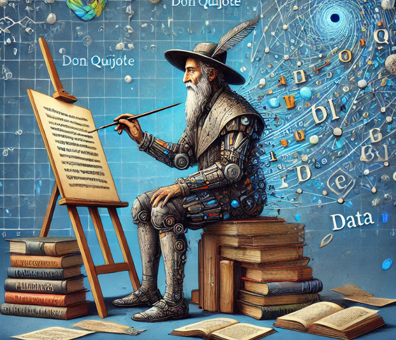

# Generador de Texto con RNN basado en Don Quijote

Este proyecto implementa un modelo de red neuronal recurrente (RNN) para generar texto carácter a carácter. Se basa en el libro **Don Quijote de la Mancha** como conjunto de datos. El objetivo es entrenar una RNN que pueda generar texto de estilo similar al del dataset.

<div align="center">

</div>

## Características

- Uso de **PyTorch** para definir y entrenar el modelo RNN.
- Implementación de tokenización personalizada para convertir texto a índices numéricos.
- Entrenamiento en GPU si está disponible, optimizando el rendimiento.
- Generación de texto de forma iterativa a partir de una frase inicial.

---

## Tabla de Contenidos

1. [Requisitos](#requisitos)
2. [Estructura del Proyecto](#estructura-del-proyecto)
3. [Uso](#uso)
4. [Detalles Técnicos](#detalles-técnicos)
5. [Resultados Esperados](#resultados-esperados)
6. [Problemas Comunes](#problemas-comunes)
7. [Créditos](#créditos)

---

## Requisitos

Antes de ejecutar este proyecto, asegúrate de tener instalados los siguientes paquetes y herramientas:

- Python 3.8 o superior
- PyTorch con soporte para CUDA (opcional para GPU)
- Bibliotecas necesarias (instalar con `pip`):
  ```bash
  pip install torch torchvision tqdm wget numpy
    ```
## Estructura del Proyecto
El proyecto está organizado de la siguiente manera:
  ```bash
deep-learning/
├── resources/ # Recursos estáticos y multimedia
│ └── don_quijote_generativo.png
├── src/ # Código fuente del proyecto
│ └── charrnn2.py # Implementación principal del modelo
├── .gitignore # Archivo para ignorar archivos no deseados en Git
├── README.md # Documentación del proyecto
  ```
## Uso
1. Clonar el Repositorio
Clona este repositorio en tu máquina local:
```bash
git clone https://github.com/tu-usuario/char-rnn-quijote.git
cd char-rnn-quijote
```
2. Ejecutar el Programa
Ejecuta el archivo main.py:
```bash
python main.py
```
El modelo descargará automáticamente el dataset de Don Quijote, lo procesará y comenzará el entrenamiento.

## Detalles Técnicos
### Tokenización
El texto se convierte a índices numéricos mediante un tokenizer personalizado, que mapea cada carácter único a un índice entero. 
Esto permite procesar el texto como secuencias de números.

### Arquitectura del Modelo
El modelo **`CharRNN`** consiste en:

1. Capa de Embeddings: Representa cada carácter como un vector de una dimensión fija.
2. Capa LSTM: Procesa las secuencias para aprender dependencias entre los caracteres.
3. Capa Fully Connected: Genera una distribución de probabilidad sobre los posibles caracteres.

### Entrenamiento
El modelo se entrena utilizando **CrossEntropyLoss** y el optimizador Adam. Los datos se dividen en conjuntos de entrenamiento (80%) y validación (20%).

## Resultados Esperados
### Generación de Texto
Después del entrenamiento, el modelo puede generar texto similar al del estilo de Don Quijote. El texto se genera carácter a carácter, agregando cada predicción como entrada para el siguiente paso.

Ejemplo de texto generado:
```
En un lugar de la mancha, de cuyo nombre no quiero acordarme, no ha mucho tiempo que vivía un hidalgo
de los de lanza en astillero, adarga antigua, rocín flaco y galgo corredor.
```

## Problemas Comunes
1. El modelo no usa GPU:
- Asegúrate de que PyTorch tiene soporte para CUDA:
```python
import torch
print(torch.cuda.is_available())
```
- Si no, reinstala PyTorch con soporte CUDA:
```bash
pip install torch torchvision --index-url https://download.pytorch.org/whl/cu118
```
2. Texto generado repetitivo:
- Ajusta la temperatura en la generación para aumentar la diversidad:
```python
y_pred = y_pred.view(-1).div(temperatura).exp()
```

## Créditos
Desarrollado por Daniel Sánchez Parra y Daniel Torres Galindo.

Inspirado en el tutorial de redes neuronales recurrentes basado en CharRNN.

https://youtu.be/uZ2bH5O_8f0

https://github.com/karpathy/char-rnn
